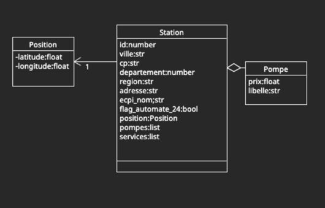

# Les stations essence en France

## Objectifs
- réaliser quelques classes
- parser des flux json
- realiser des appels à une API

## Le diagramme de classes

Vous devez représenter à l'aide de classes les élements pour représenter une station essence.

Sachant que : 
- une station essence posséde un id, une adresse, un ensemble de services
- la station essence posséde une position avec une latitude et une longitude
- la station posséde un ensemble de carburant
- un carburant a un nom et un prix

## Extraction de données

Le fichier **assets/data.json** contient un flux json contenant un ensemble d'enregistrements **records**. 

### Etape 1

Chaque enregistrement contient des champs **fields** contenant la description d'un carburant

Un carburant contient à la fois des informations sur la station et sur le carburant.

La premiere étape du parsing est de parser chaque record afin d'avoir une instance de la classe Station avec un type de carburant.

### Etape 2
Regrouper votre liste de stations obtenues à l'étape 1 dans une seule instance de station contenant une liste de carburant.

Le regroupement doit s'executer par la valeur de **id** qui est identique pour une station donnée.

### Un peu de recherche

En utilisant la fonction **sorted**, rechercher la station ayant le SP95 le moins cher

Créer une méthode **has_service** dans la classe **Station** prenant en paramétre un nom de service et retournant True
si la station dispose de ce service

En utilisant la méthode **filter**, Afficher la liste des stations ayant le service **Station de gonflage**

## Exploiter une api JSON

Le gouvernement fournit une api fournissant les prix des carburants en France. L'url de cette API est **https://data.economie.gouv.fr/api/records/1.0/search/?
**

En passant en paramétre, 
- dataset=prix-carburants-fichier-instantane-test-ods-copie
- q=ville%3DLILLE

Il est possible de récuperer les stations de la ville de LILLE. 

En utilisant le module requests, interroger cette API afin d'afficher la liste des stations disponibles pour une ville passée en paramétre.

## Note 

>Afin de facilter l'implémentation, je vous propose d'utiliser du TDD Test Driven Development.

Ce mode de développement cconsiste à réaliser les tests avant de réaliser l'implémentation. 

Le fichier **test_station.py** contient ainsi un ensemble de tests permettant de valider les différentes étapes.

Le code que vous allez réaliser doit être dans le fichier **station.py**.

- test_should_load_from_dict :  Teste si la méthode **station.Station.from_dict** prenant en paramétre un dictionnaire representant une station retourne une instance de la classe **Station**
- test_should_load_from_txt : Teste si la méthode  **station.Station.parse_from_text** prenant en paramétre le contenu d'un fichier **assets/data.json** retourne une liste de stations.
- test_should_filter_by_service : Teste si la méthode **station.Station.filter_by_service** prenant une liste de stations et un type de service recherché retourne la liste des stations possédant ce service
- test_should_sort_by_carburant :Tests si la méthode **station.Station.sort_by_carburant** prenant une liste de stations et un type de carburant retourne la liste des stations proposant ce carburant classées du moins cher au plus cher.

